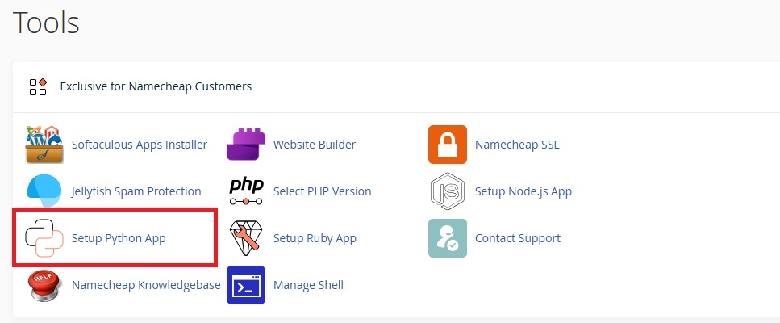
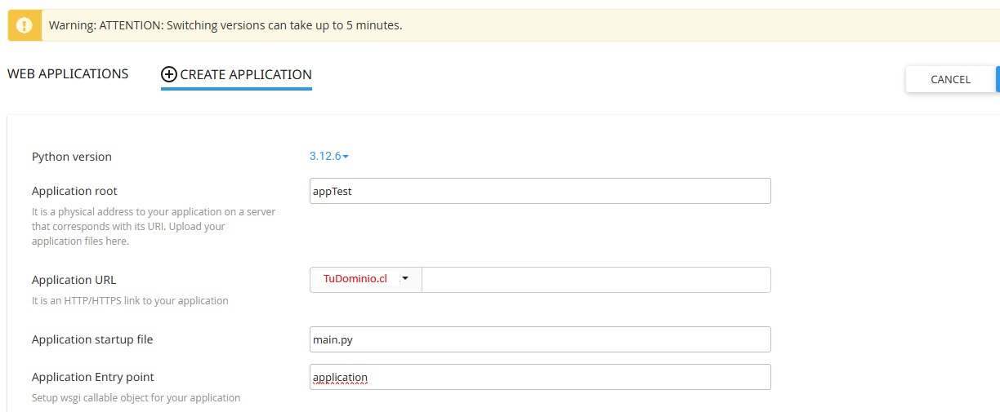
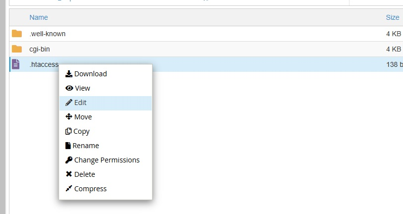
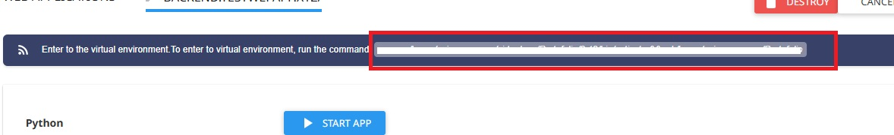
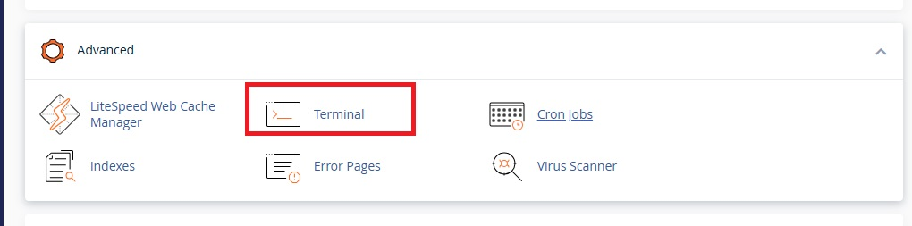
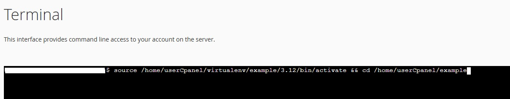
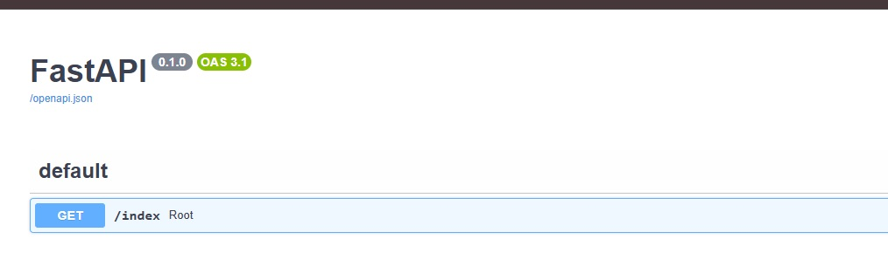

# Example to Deploy FastAPI to cPanel

## Start creation Project

### Create folder
``` bash
    mkdir backend
    cd backend
```
### Create Env
``` bash
    python -m venv env
```
### Activate Virtual Environment
``` bash
    env\Scripts\activate
```

### Install Libraries

``` bash
    pip install fastapi uvicorn[standard]
```


### Create api(Module)
create api in main.py
``` python

from fastapi import FastAPI
app = FastAPI()

@app.get('/index')
async def root():
    return {'message': 'Hello World'}

```

### Init the project
init the project
``` bash
    uvicorn main:app --reload
```


# DEPLOY : Project Cpanel

## Script Cpanel


create Aplication:





after creating it we stop it


stop App

### Step 01

In your domain folder
modify file: .htaccess in the folder of domain example: dominio.com


replace all

``` bash
RewriteEngine On
RewriteCond %{REQUEST_FILENAME} !-f
RewriteCond %{REQUEST_FILENAME} !-d
RewriteRule ^(.*)$ http://127.0.0.1:8000/$1 [P,L]
```

### Step 02

use your favorite ssh connection tool, in my case I use MobaXterm

copy the conection app


Example:
``` bash
source /home/userCpanel/virtualenv/example/3.12/bin/activate && cd /home/userCpanel/example

```
You can also use the CPanel terminal


### Step 03

Install libraries
``` bash
pip install fastapi uvicorn[standard]

```
### Step 04

Activar el Dominio
``` bash
uvicorn main:app --host 0.0.0.0 --port 8000

```

### Step 05

Go to Domain  

domain.com/docs

